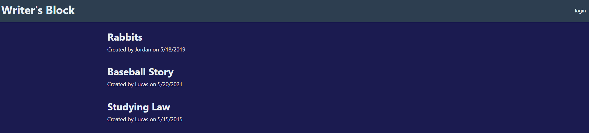

# lucas-saaler-tech-blog
## Description
This application allows user to publish their writings, and allows the community to edit them constructively so authors can improve their writings with community input. 
## Table of Contents
- [License](#license)
- [Installation](#installation)
- [Usage](#usage)
- [Credits](#credits)
- [Development](#development)
## License

## Installation
After you download this file, run "npm i" in your terminal to install the required libraries.
## Usage
When you open the webpage you will see a home page with a list of writings submitted by users. You can click into any of the listed stories to be able to view oe edit them. Anybody can edit anybodies stories with contructive input after loging in. To login, click the login button at the top right of the website. After you login, you'll be taking to a page where you can write a new story. To write a new story, fill out the name and description fields with the name of the story and its contents respectively. 

## Credits
Lucas Saaler
Jordan Heidlage 
Muse Jama 
Alec Westbrook 
Ismail Saoudi 
Node, Express, Mysql, Sequelize, Axios 

